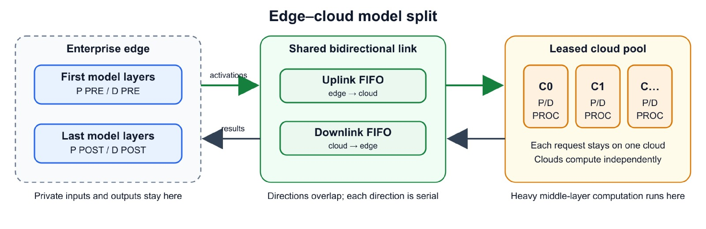
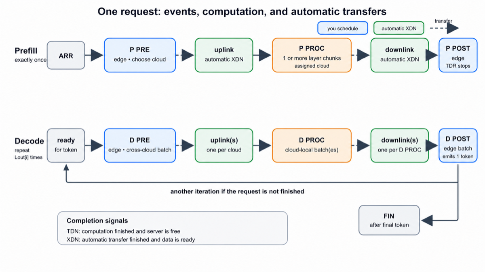
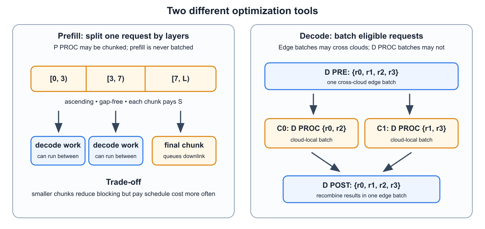
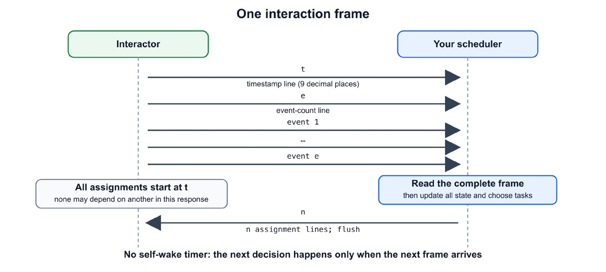
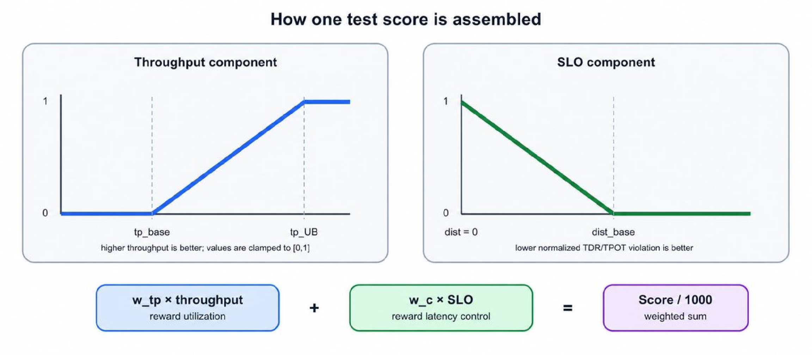

# Problem A — Edge–Cloud Collaborative Scheduling

> Faithful transcription of the official statement, ICPC 2026 Online Challenge 1
> powered by Huawei. Source: <https://codeforces.com/contest/2251/problem/A>,
> captured 2026-08-14 21:36 UTC+7. Original PDF preserved at
> `artifacts/originals/problem-A-codeforces-2026-08-14T2136.pdf`
> (SHA-256 `fc5f927c6b617ffe02de8db5770e0b28cbc85b2b5520ad976303afa81eab7a8c`).
> Raw extraction: `statement_pdftotext_layout.txt`. Figures: `figures/`.
>
> **This file is the working copy. If it ever disagrees with the live Codeforces
> page, the live page wins** — re-download and re-transcribe rather than patching
> from memory.

| Item | Value |
|---|---|
| Contest | ICPC 2026 Online Challenge 1 powered by Huawei |
| Problem | A. Edge–Cloud Collaborative Scheduling |
| Type | Interactive, non-adaptive, deterministic per test |
| Time limit | 15 seconds per test |
| Memory limit | 256 MB |
| Language shown | GNU G++23 14.2 (64 bit) |
| Hacks | Not open to hacks |

The interactor sends events as they happen; after each event group you choose ready
tasks to start. You never predict future requests. For a fixed test it is
deterministic and non-adaptive: the same legal responses produce the same events
and the same score.

## No AI background is needed

Treat this as jobs moving through computers; no text-generation knowledge is
needed. A token is one output unit. Commands `P PRE`/`P PROC`/`P POST` prepare a
request once; `D PRE`/`D PROC`/`D POST` produce one token. Both follow
local → remote → local.

### Glossary

| Term | Meaning |
|---|---|
| edge / local | the one computer beside users (server id `E`) |
| cloud / remote | one of `K` worker computers (server ids `C0 … C(K-1)`) |
| token | one output unit |
| prefill / input stage | one-time input preparation |
| decode / output step | repeated work producing one token |
| uplink / UP | local-to-remote transfer |
| downlink / DOWN | remote-to-local transfer |
| FIFO queue | first transfer queued is the first transfer completed |
| batch / group | requests combined in one output task |
| chunk / piece | a consecutive range of input-stage parts |
| activations | transferred request data; its size is defined by the protocol |
| model layers / parts | the numbered input-stage range `[0, num_layers)` |

## The problem in one minute

One local computer and several remote computers handle requests. Each request
first prepares its input by making this trip:

```text
local computer --> remote computer --> local computer
```

The same trip is then repeated once per token. The first trip is the **input
stage**; each later trip is an **output step**. Transfers are automatic; you
choose ready tasks for free computers.

The score rewards output rate and short waits. **TDR** (time to decode ready) ends
when the first output step can begin, before a token is produced. **TPOT** (time
per output token) is the mean gap between consecutive tokens.



*Blue is local, green is the shared two-way link, orange is remote; computation
and transfer may overlap. Each direction of the link is serial; the two directions
overlap. Each request stays on one remote computer.*

## Challenge format

Two worked examples appear at the end of the statement. Test 1 is the public
worked Example 1, tests 2–22 are hidden preliminary tests, and finals use a
separate frozen set. Per-test scores are reported on the 0–1000 scale defined
below, and the contest system aggregates them according to the contest rules; no
hacks are used.

## What you control

You choose:

- which legal task to start on each free computer;
- the remote computer assigned to a request when scheduling its `P PRE`;
- how to split an input-stage `P PROC` into ranges of numbered parts; and
- which ready requests to combine into each output group.

Transfers are automatic. For a first solution, use one full input-stage piece and
groups of size 1.

## System model

- There is one local computer and `K` identical remote computers, numbered `0`
  through `K-1`, written `C0, C1, …`. They work independently and may run while
  data moves.
- There are `R` requests in total, but **`R` is not announced**. Request ids are
  `i = 0, 1, …, R-1` in arrival order. The arrival time of request `i` is the
  timestamp of its `ARR` event. That event reveals its input length `L_in[i]`; its
  output length `L_out[i]` **remains hidden** until a `FIN` event reports that it
  has finished.
- Request `i` performs one token-free input stage, then exactly `L_out[i]` output
  steps, each producing one token. Total generated tokens are `Σ_i L_out[i]`, with
  `L_out[i] >= 1`.
- You assign each request to one remote computer in its `P PRE` task. **The choice
  is fixed**: all later input-stage tasks for that request name the same remote
  computer, and every `D PROC` containing it runs there. Output-step tasks on the
  local computer may combine requests from different remote computers.
- Each computer executes at most one task at a time. Once a task starts, it cannot
  be paused. Separately scheduled input-stage pieces may be alternated with other
  work.
- **Schedule cost `S`**: a task assigned at time `t` with execution duration `dur`
  occupies its computer over `[t, t + S + dur]`. The cost is paid **once per
  task**, including once per input-stage piece and once per output group.
  Transfers do not pay `S`.
- Execution times are fixed: task duration depends on its step and group size (and
  fraction of parts for input-stage pieces), never on the output-token position or
  saved internal data size. See the task-time table. Finished tasks and transfers
  are reported as `TDN` and `XDN`.

## Request lifecycle



*Solid arrows are scheduling dependencies; dashed arrows are automatic transfers.
TDR ends at `P POST`; each later `D POST` makes one token.*

`PRE`/`POST` use the local computer; `PROC` uses the assigned remote; transfers use
the shared link.

### Input stage

Three steps: first (local) → process (assigned remote) → final (local). **An
input-stage group has exactly one request.**

- **`P PRE`** (local computer). May start after: the request's `ARR` event. Fixes
  the remote computer; on completion the local-to-remote transfer is queued
  immediately (whether or not that remote computer is busy).
- **`P PROC`** (remote computer) computes all `num_layers` numbered parts. The
  simplest choice is one full piece `[0, num_layers)`. You may split it so other
  remote work can run between pieces.
- **`P POST`** (local computer). May start after: the request's input-stage
  remote-to-local transfer `XDN`. Completion makes the request ready for producing
  output; TDR is measured from arrival to this completion.

**Exact splitting rules.** Each piece is a nonempty integer range `[ls, le)`: it
includes part `ls` and stops before part `le`. For each request, pieces must be
issued in ascending, gap-free order: the first starts at `0`, each later `ls`
equals the previous `le`, and the last ends at `num_layers`. Thus there are at
most `num_layers` pieces, and none when `num_layers = 1` beyond the full piece.
The first piece waits for the input-stage local-to-remote transfer `XDN`; each
later piece waits for the previous piece's `TDN`. Its duration is

```text
dur = (le - ls) / num_layers * prefill_proc(L_in[i])
```

Only the **last** piece queues the input-stage remote-to-local transfer, of length
`L_in[i]`. No transfer occurs between pieces. Any range that is empty, outside the
part interval, out of order, or leaves a gap is a violation.

### Output steps

After the input stage, request `i` performs `L_out[i]` output steps in succession:
completing iteration `k`'s final step readies iteration `k+1`. The same three steps
are used, but multiple requests may be grouped per step. You choose each group
independently. **Output-step tasks cannot be split into part ranges.**

- **`D PRE`** (local computer, across remote computers): may group requests
  assigned to any mix of remote computers — the listed `decode_pre` time depends
  only on total group size, so across-remote grouping improves local-computer
  efficiency (the task-time table plus the transfer formula is the only efficiency
  model; nothing else rewards grouping). May start after, for each request:
  completion of that request's previous final step (`P POST` for its first output
  step, otherwise its previous `D POST`) — and the request must not be finished
  (`FIN` always arrives with the final `D POST` `TDN`, so you always know).
  Completion queues **one local-to-remote transfer per distinct remote computer**
  in the group (`len` = that remote computer's member count), enqueued
  simultaneously in increasing remote-computer index order.
- **`D PROC`** (remote computer): all members must be assigned to that remote
  computer. May start after, for each request: the local-to-remote transfer `XDN`
  carrying that member's current-iteration data — the rule is checked **separately
  for each request**: members may come from different `D PRE` groups and different
  local-to-remote transfers. Completion queues one remote-to-local transfer
  (`len` = this group's size).
- **`D POST`** (local computer, across remote computers). May start after, for each
  request: the remote-to-local transfer `XDN` carrying that member's
  current-iteration result (different `D PROC` groups / remote-to-local transfers
  are fine). Each member's completion produces one token.



*The upper lane splits one input stage into consecutive ranges; the lower lane
groups ready requests for output.*

**Groups**: `m >= 1`, request ids distinct, every member satisfying its predecessor
rule; `m = 1` is always allowed. Only output work is ever grouped — input-stage
groups always contain exactly one request. **There is no other group-size limit**:
no maximum exists or is announced — any nonempty set of distinct, currently ready
requests may be grouped, subject only to the step and remote-computer rules above.

## Input

### Protocol guide

`P` is the one-time input stage; `D` is one output step. `PRE`/`POST` are local
tasks and `PROC` is remote. Events are `ARR` (arrival), `TDN` (task done), `XDN`
(transfer done), and `FIN` (finished). In `[ls, le)`, `ls` is included and `le`
excluded. Input arrives interactively: read each whole frame and respond once.
Times are real milliseconds; counts, lengths, and ids are integers; fields use
single spaces.

### Startup configuration

The interactor first sends two lines (no response expected): the system
parameters, then the scoring parameters:

```text
K S latency_in_ms bandwidth_gbps bytes_per_token num_layers
SLO1 SLO2 tp_UB tp_base dist_base w_tp w_c
```

`K`, `bytes_per_token`, and `num_layers` are integers; all other values are reals
(times in ms, output rates in tokens/ms). SLO stands for service-level objective:
`SLO1` is the TDR target and `SLO2` is the TPOT target. `bandwidth_gbps` is in
gigabits per second (Gb/s). **`bytes_per_token` is already the complete data size
for one token; do not multiply it by an element width.**

### Communication

Transfers are automatic: the interactor queues them when their triggering
computation finishes; you never output a transfer command. A single link connects
the local computer and the remote-computer side and is shared by all remote
computers. `UP` means local → remote, `DOWN` means remote → local. These are
**independent one-at-a-time FIFO queues**: transfers finish in the order they
enter, and both directions may be active simultaneously.

Queue-entry order for simultaneous events: one `D PRE`'s per-remote transfers
enter by increasing remote index. Otherwise transfers enter in interactor event
order; tasks started together and finishing together use assignment-line order.

```text
transfer_time = latency_in_ms + 8 * data_bytes / (bandwidth_gbps * 1e6)   [ms]
data_bytes    = len * bytes_per_token
```

The factor 8 converts bytes to bits. For an input-stage transfer of request `i`,
`len = L_in[i]`; for output steps, use the per-remote-computer local-to-remote
transfer size and the per-group remote-to-local transfer size. Guaranteed
`latency_in_ms > 0`: every transfer takes strictly positive time.

### Task-time table

Before requests arrive, the judge gives you a table telling you how long tasks
take, in milliseconds. You only read this table; you do not measure the times
yourself. Read an integer `N`, then `N` rows of 7 values; no response is expected:

```text
batch_size prefill_pre prefill_proc prefill_post decode_pre decode_proc decode_post
```

`batch_size` means the number of requests grouped into one task. Names containing
`prefill` refer to the input stage, names containing `decode` refer to output
steps. These fixed names come from the protocol; no AI knowledge is required.

**`batch_size` means `L_in` for the three input-stage columns** (one request per
input-stage group) **and member count for the three output columns.** The
`batch_size` values are distinct positive integers in `[1, 4096]`. A listed
output-step group size may exceed the test's `R`; such a row only defines the
task-time table and does not make that group size schedulable. Not every step is
listed at every group size; **a missing value is `-1`**. Rows are given in no
guaranteed order. Guarantee: every step column contains at least one non-missing
entry.

All listed values are execution durations **excluding** the schedule cost `S`,
exactly like the `dur` field of every `TDN`: the total time a computer is busy with
a task is always `S + dur`.

**Interpolation.** For each step, sort the available rows by group size. If the
needed size is listed, use its time. If it lies between two listed sizes, draw a
straight line between their times and use the value on that line. Below the
smallest size, use the first time; above the largest size, use the last time. The
result is the same on every remote computer and never changes. Guarantee: every
resulting legal task duration is strictly positive.

`R` is the test's total request count; it is not announced during the interaction
and is **not** a separate group-size limit. No maximum output group size exists
beyond the number of currently ready requests. The duration of every completed
task is echoed in its `TDN`'s `dur` field.

### Event frames (your turns)

The interactor sends a frame whenever one or more events occur. A frame contains:
one timestamp line `t`, one event-count line `e`, then `e` event lines. Always read
the whole frame before deciding what to do.

The frame timestamp is its event time, printed with 9 decimal places; printed
timestamps are nondecreasing, while the internal event times of consecutive frames
are strictly increasing. Only events with exactly the same internal timestamp are
coalesced. A later event is never moved to an earlier frame, and line order carries
no scheduling priority. Your response may use any event in the frame: every
resource freed by a `TDN` is free, even if that event is the last line. Guarantee:
`FIN` appears beside the `TDN` of that request's final output final step. After
reading such a frame, the request is finished and must not appear in your response
to that frame or any later response.



*Read the whole event frame, update state, then print one count and exactly that
many assignments.*

| Event | Meaning |
|---|---|
| `ARR <rid> <L_in>` | request `rid` arrived; its arrival time is this frame's timestamp `t`. `L_out` is unknown. |
| `TDN <server> <task_spec> <dur>` | a task completed and its server is now free. `task_spec` is echoed in a canonical equivalent form: integers use ordinary decimal notation and fields use single spaces; `dur` is the execution duration, excluding `S`, printed with 9 digits after the decimal point. |
| `XDN <UP\|DOWN> <remote> <size> <PRE\|DEC> <m> <rid...>` | a transfer completed (its data has arrived). `size` is in bytes (`= len * bytes_per_token`); `PRE`/`DEC` marks an input-stage or output-step transfer; per-remote-computer transfers each produce their own `XDN`; for the input stage `m = 1`. |
| `FIN <rid>` | the request finished all output steps (its last token was just produced). It must not appear in any task you assign from now on. |

The `m` request ids listed in an `XDN` are exactly the requests whose data the
transfer carries: the single request for the input stage; that remote computer's
members of the triggering `D PRE` for an output-step local-to-remote transfer; the
members of the triggering `D PROC` group for an output-step remote-to-local
transfer.

`<server>` = `E` (local computer) or `Ck` (remote computer `k`); `<m>` is the number
of request ids that follow. Request ids are integers `0, 1, …, R-1`, assigned in
arrival order, never reused.

## Constraints

- `1 <= K <= 8`; `1 <= R <= 2000`; `1 <= L_in[i] <= 4096`; `1 <= L_out[i] <= 512`;
  `Σ_i L_out[i] <= 2·10^5` per test; `1 <= num_layers <= 64`; `2 <= N <= 4096`.
- `1 <= S <= 10`; `0.001 <= latency_in_ms <= 50`; `0.001 <= bandwidth_gbps <= 100`;
  `1 <= bytes_per_token <= 10^6`.
- `0.001 <= SLO1, SLO2 <= 10^9`; `0 <= tp_base, dist_base <= 10^9`;
  `10^-9 <= tp_UB <= 10^9`; and `tp_UB > tp_base`.
- Every non-missing task-table entry is in `[0.001, 10^4]` ms. System reals, task
  times, timestamps, and durations use 9 decimal places.
- Arrival timestamps are nondecreasing in `[0, 10^9]` ms. Completion frames may
  exceed `10^9`, but the validator guarantees a conservative upper bound of
  `10^12` ms even if every legal task and transfer is serialized; all timestamps
  are nonnegative finite doubles.
- You never need to predict event timestamps to keep the protocol correct: every
  completion is announced by the interactor (`TDN`/`XDN`) with its timestamp and
  duration, so a purely reactive scheduler needs no arithmetic on future times. If
  you simulate ahead for planning, use ordinary double-precision arithmetic with
  the piecewise-linear lookup and transfer formula above.
- At most `2·10^6` frames per test; use fast I/O.
- Degenerate values (e.g. `K = 1`, `num_layers = 1`) occur and simply disable the
  corresponding mechanic.

## Output

After every frame (one turn), print a count `n` (`0 <= n <= K + 1`), followed by
`n` assignments. For readability the examples put one assignment on each line, but
the parser accepts arbitrary whitespace between tokens. Each assignment has the
form `<server> <task_spec>`. It starts one task on a computer that is currently
free. The command words are fixed output syntax; copy them exactly. Integer tokens
use the ordinary signed-decimal syntax accepted by C++ conversion (an optional
leading `+` and leading zeros are accepted); echoed integers are canonical decimal.
A response containing no assignments is simply:

```text
0
```

For a first scheduler, most responses may contain only zero or one task.
Unmentioned resources stay idle. You may leave any free computer idle even when
one or more legal tasks are available. Waiting can be a useful grouping choice, but
do not create the stuck state with no future event described below. Every frame is
a scheduling opportunity, including frames containing only transfers or arrivals.
After reading the whole frame, you may use any predecessor or free resource
reported anywhere in it.

When deciding whether a task is legal, ask three questions: **Is its computer
free? Has every required predecessor event arrived? Is every request in the task at
exactly this step and not already in flight or finished?**

All assignments in one response begin simultaneously at timestamp `t`. One cannot
depend on another assignment from that same response. Assign at most one task to
each resource; it becomes free again only when its `TDN` arrives.

### The six legal task shapes

| Step | `task_spec` | Server |
|---|---|---|
| input stage first step | `P PRE <remote> <rid>` | local computer (also fixes the remote computer) |
| input stage process | `P PROC <ls> <le> <remote> <rid>` | that remote computer |
| input stage final step | `P POST <remote> <rid>` | local computer |
| output first step | `D PRE -1 <m> <rid...>` | local computer (across remote computers) |
| output process | `D PROC <remote> <m> <rid...>` | that remote computer |
| output final step | `D POST -1 <m> <rid...>` | local computer (across remote computers) |

For `D PRE`/`D POST`, the `-1` marks a group spanning remote computers; for
`D PROC`, all members must be assigned to `<remote>`. In `P PRE`, `<remote>` must
be in `[0, K)`; in `P PROC` and `P POST`, `<remote>` must equal the request's
assigned remote computer — anything else is a violation. (`P POST` itself runs on
the local computer: its `<remote>` field carries no scheduling meaning and is
purely a consistency check against the request's fixed assignment.) Iteration
indices are never transmitted: each request's steps are strictly sequential, so
your own bookkeeping is the sole — and sufficient — source of truth for which
iteration a task belongs to.

The order of request ids within a group has no semantic effect: legality,
durations, transfer sizes, and all subsequent events depend only on the member set
(`D PRE -1 3 4 7 9` and `D PRE -1 3 9 4 7` denote the same task). Order is
preserved on echo: `TDN` repeats the same fields in canonical decimal form with
single spaces, and every `XDN` lists its request ids in the order of the triggering
task's specification — a `D PRE` group spanning remote computers has per-remote
local-to-remote transfers listing that remote computer's members as a subsequence
of your `D PRE` line; an output-step remote-to-local transfer lists the triggering
`D PROC` group in your order.

### Dependency summary

| Task | Server | Requires | Completion effect |
|---|---|---|---|
| `P PRE` | local | the request's `ARR` event | fixes the request's remote computer; queues its input-stage `UP` transfer |
| `P PROC` piece | assigned remote | first piece: the input-stage `UP` `XDN`; later piece: the previous piece's `TDN` | only the last piece (`le = num_layers`) queues the input-stage `DOWN` transfer |
| `P POST` | local | the request's input-stage `DOWN` `XDN` | stops TDR and makes the request ready for output |
| `D PRE` | local | each member's previous final-step `TDN` (`P POST` or previous `D POST`), and the request must not be finished | queues one `UP` transfer per remote computer represented in the group, in increasing remote index |
| `D PROC` | assigned remote | the `UP` `XDN` carrying each member's current-iteration data | queues one `DOWN` transfer whose length is the group size |
| `D POST` | local | the `DOWN` `XDN` carrying each member's current-iteration result | produces one token per member; after iteration `L_out[i]`, produces `FIN` |

## Interaction

Each test is a separate run of your program. **Flush the output stream after every
response.** In C++, use `cout << flush;` after printing the complete response; use
`ios::sync_with_stdio(false); cin.tie(nullptr);` for fast input. In Python, call
`sys.stdout.flush()` after printing the complete response.

The interaction proceeds: startup configuration (2 lines) → task-time table
(`N + 1` lines) → repeat {frame → your response} → `END`. Your first response
follows the first frame.

```text
read the 2 parameter lines, then N and the N warmup rows
loop:
    read one line; if it is END: exit
    parse it as timestamp t; read event count e from the next line
    read the e event lines
    update your state (completions, arrivals, transfers, FINs)
    choose assignments for currently free resources (possibly none)
    print n and the n assignment lines; flush
```

For a simple implementation, store one state per request. Its path is:

```text
ARR -> P PRE -> input stage UP -> P PROC piece(s) -> input stage DOWN -> P POST
    -> D PRE -> output UP -> D PROC -> output DOWN -> D POST
    -> either FIN or the next D PRE
```

Move a request to its next state only when the corresponding event appears in a
frame. Mark a computer busy when you assign it and free only when its `TDN`
appears. Tracking these states is enough for a correct solution. You do not need to
predict when tasks will finish.

**You act only when a frame arrives.** There is no timer or self-wake mechanism:
you cannot ask to be woken at a chosen future time, and you cannot deliberately
idle a computer until an arbitrary moment. A task can only be assigned in response
to a frame, at that frame's timestamp. If you delay an action, you must wait for a
future event frame.

### Mistakes that give zero points on a test

A legal but slow choice is still valid; it only lowers your score. These score 0:

1. Assigning a task to a busy computer, or two tasks to one resource in a single
   response.
2. Assigning a task before all of its required earlier events have been delivered.
   This includes referencing a `rid` that has not arrived and re-issuing a
   completed step.
3. Including a request that is already part of an in-flight task, or that has
   already finished (`FIN`).
4. Wrong remote computer: `P PROC`/`P POST` with a remote computer other than the
   request's assigned one; `P PRE` with a remote computer outside `[0, K)`; a
   `D PROC` member assigned to a different remote computer.
5. Illegal piece: empty (`ls = le`), outside `[0, num_layers]`, or not ascending
   and gap-free.
6. Malformed group: `m < 1` or duplicate request ids.
7. Malformed or unparsable output.
8. Reaching a stuck state with unfinished requests and no possible future event.
9. Exceeding the time or memory limit.

### Errors and stream closure

The interactor never produces `-1` as a failure response. This is unrelated to the
mandatory `-1` marker in participant commands `D PRE` and `D POST`. On a protocol
violation or malformed response it simply stops: the test scores 0 and no further
frames are sent. If reading input ever fails or reaches end-of-file, **exit
immediately with exit code 0** — do not block waiting for more input and do not
crash; the verdict is determined by the interactor, not by your exit path.

### Getting stuck

If unfinished requests remain but no task, transfer, or future arrival can create
another event, the run is stuck. The interactor detects this stuck state,
terminates, and assigns 0 to the test. While future arrivals remain, responding
with 0 assignments is safe because time advances to the next arrival. Delaying a
request hurts the score; permanently abandoning it can cause this stuck state.

### Termination

When all requests have finished, the interactor sends `END` (a single line, in
place of the next frame's header) after reading your response to the final frame.
Read it and exit.

**The total number of requests `R` is not announced in advance and there is no "no
more arrivals" signal — you cannot distinguish a lull from the end of the stream.**
This is intentional; plan your grouping accordingly.

## Scoring

You do not need to calculate the score to write a valid scheduler. First make a
scheduler that finishes every request legally. It balances two intuitive goals:

- **Output rate**: finish more output tokens per millisecond of simulated time.
- **Waiting time**: make requests ready for output promptly and avoid long gaps
  between produced tokens.

Each goal becomes a component in `[0, 1]`. The weights `w_tp` and `w_c` say how
much that test values each goal, and the final score is their weighted sum times
`1000`.

Guarantees: `w_tp, w_c >= 0`; `w_tp + w_c = 1`; `SLO1 > 0`; `SLO2 > 0`;
`tp_UB > tp_base`; `dist_base >= 0`. Either weight may be 0, but every request must
still be completed and every input/output rule obeyed.

```text
clamp(x; base, target) = max(0, min(1, (x - base) / (target - base)))
```

(0 at `base`, 1 at `target`, clamped outside.)

### Output-rate component

```text
tp = (Σ_i L_out[i]) / total_elapsed_time            [tokens/ms]
total_elapsed_time = (latest final-token production time over all requests)
                   - (earliest request arrival time)                    [ms]

output_rate_component = clamp(tp; tp_base, tp_UB)
```

`tp_base` comes from a fixed one-request-at-a-time reference schedule; `tp_UB` is
an estimated high rate. At or below the baseline the component is 0; at or above
the upper bound it is 1; between them it grows linearly. These values set scoring
and are not promises about any solution in the testing kit.

### Waiting-time component

`SLO1` is the target average wait until a request is ready for its first output
step (TDR). No token has been produced at this point. `SLO2` is the target mean gap
between consecutive produced tokens (TPOT). For request `i`, let
`e_1 < e_2 < … < e_{L_out[i]}` be its token production times, i.e. the completion
times of its output `D POST` tasks.

```text
tdr  = mean over all requests of (input-stage final-step completion - arrival)
tpot = mean of (e_{j+1} - e_j) over all consecutive output gaps of all requests,
       pooled (1 <= j < L_out[i])
```

A request with `L_out[i] = 1` contributes no gaps. **If no request contributes a
gap, `tpot` is defined as 0.**

```text
excess_tdr  = max(0, (tdr  - SLO1) / SLO1)
excess_tpot = max(0, (tpot - SLO2) / SLO2)
dist        = sqrt(excess_tdr^2 + excess_tpot^2)
```

`waiting_time_component = clamp(dist; dist_base, 0)` — the same conversion with
lower values treated as better: lower `dist` is better, 1 at `dist = 0`, 0 at the
reference scheduler's amount above the waiting-time targets `dist_base`. Written
out directly:

```text
                          | max(0, 1 - dist / dist_base)   if dist_base > 0
waiting_time_component =  | 1                              if dist_base = 0 and dist = 0
                          | 0                              if dist_base = 0 and dist > 0
```

**Important special case:** if `dist_base = 0`, the waiting-time component is
either 0 or 1. It is 1 only when both mean-waiting-time targets are met
(`dist = 0`), and 0 otherwise.



```text
NormalizedScore = w_tp * clamp(tp; tp_base, tp_UB) + w_c * clamp(dist; dist_base, 0)
Score           = 1000 * NormalizedScore
```

Each completed test awards a score in `[0, 1000]`.

**Verdicts.** A completed interaction scores as above. A protocol error, malformed
output, stuck state with no future event, or exceeding the time/memory limit scores
0 on that test; other tests are unaffected. **No partial credit is awarded for an
unfinished test.**

**Contest aggregation.** The 22 preliminary tests provide feedback and do not
contribute to the final ranking. The final score is the arithmetic mean of the 20
frozen final-test scores. Ranking uses that mean before display rounding; the
displayed score is rounded to three digits after the decimal point. This problem is
not open to hacks.

## Examples

See [`EXAMPLES.md`](EXAMPLES.md) for both worked examples, the machine-readable
transcripts in `data/public/`, and an independent hand-verification of every
timestamp.

The examples use `S = 1`, `latency_in_ms = 2`, `bandwidth_gbps = 1`, and
`bytes_per_token = 125000`. Because bandwidth is in gigabits per second, a
one-token transfer takes `2 + 8 * 125000 / 10^6 = 3` ms.

> An output task's time depends only on its group size, never on which output token
> is being generated or how many tokens are in the request's previously stored
> data. **The task-time table and transfer formula are the complete cost model.**
